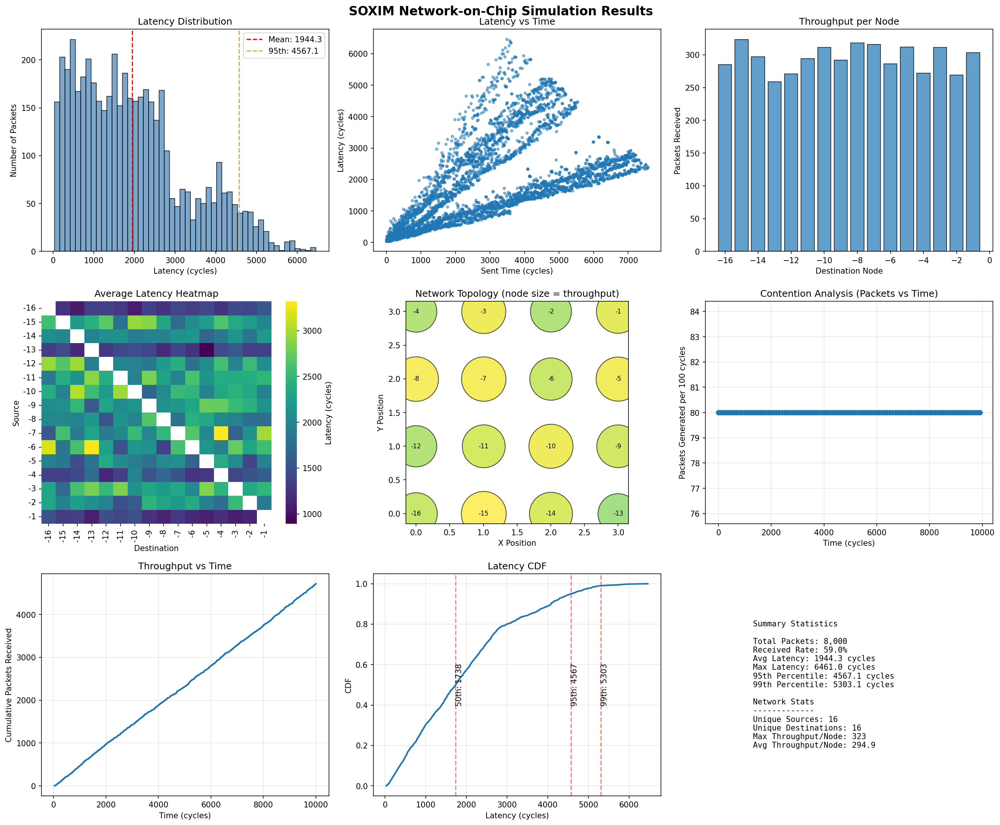
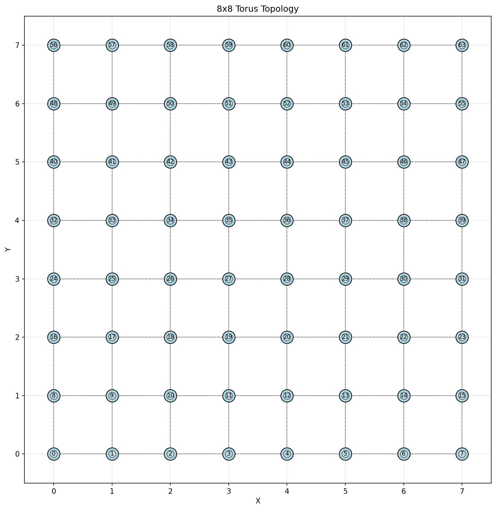
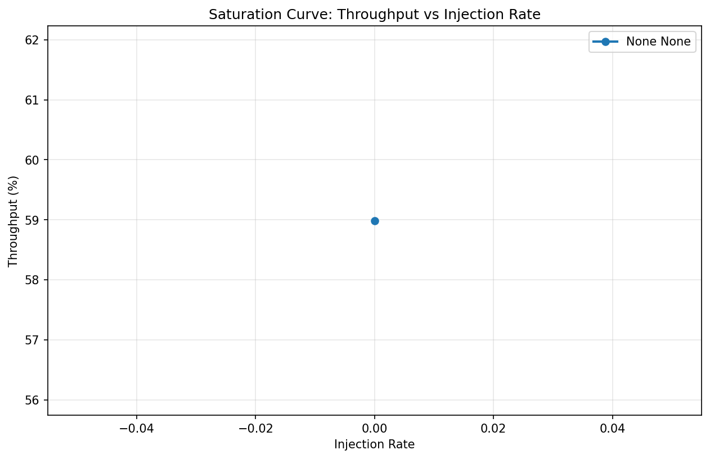
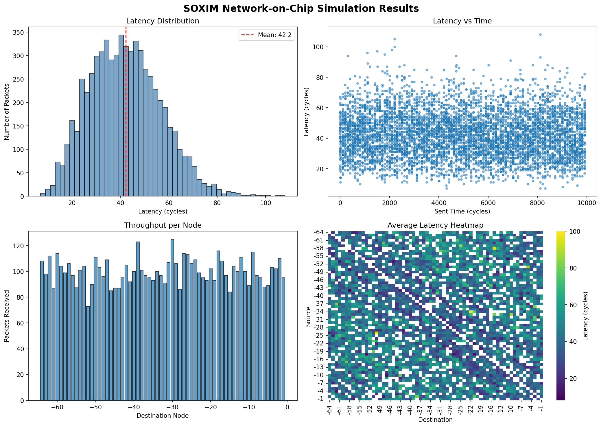
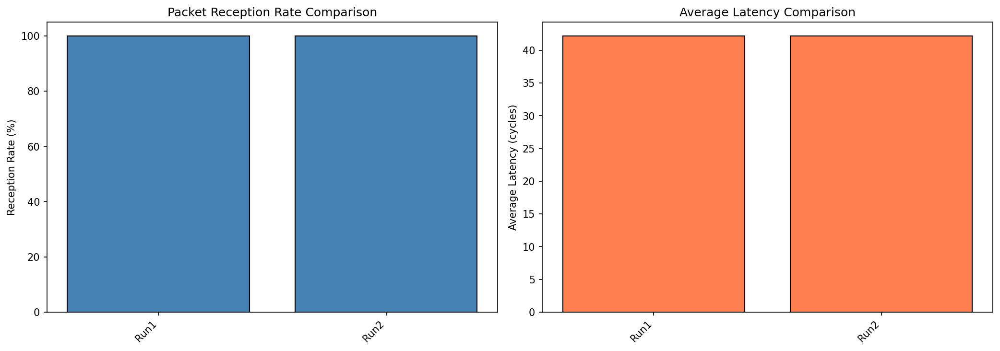
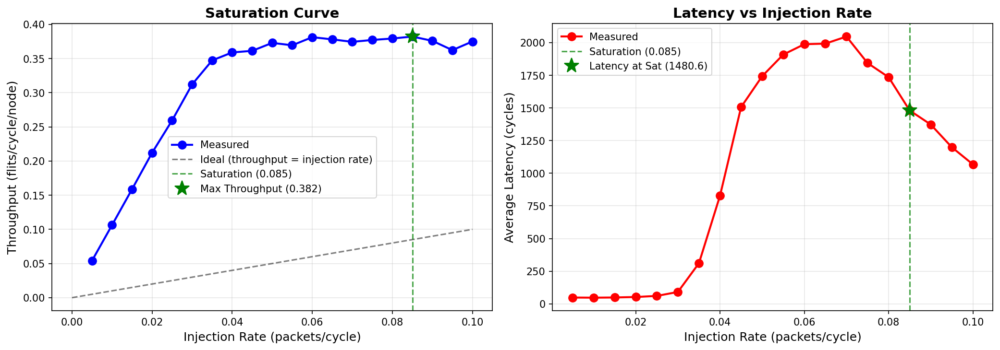

# SOXIM - Network-on-Chip Simulator

A cycle-accurate Network-on-Chip (NoC) simulator for multi-core processor interconnection networks.

## Features

- **Topologies**: 2D/3D Mesh and Torus networks
- **Routing Algorithms**:
  - Dimension-Order Routing (DOR)
  - Randomized Oblivious Multi-phase Minimal (ROMM)
  - Minimal Adaptive (MAD)
  - Valiant's Randomized Algorithm (VAL)
  - Odd-Even Adaptive routing
- **Virtual Channels**: Configurable number of virtual channels per port
- **Traffic Patterns**: Random uniform, permutation, Periodic, Bernoulli, Markov injection processes
- **Performance Metrics**: Throughput, latency, saturation analysis
- **Comprehensive Testing**: 128+ unit tests covering all components
- **Enhanced Visualization**: Python tools for heatmaps, saturation curves, and topology visualization
- **CI/CD Pipeline**: Automated testing, code coverage, and Docker support

## Project Structure

```
soxim/
├── CMakeLists.txt          # Root CMake configuration
├── README.md               # This file
├── configs/                # Configuration files
│   ├── example.toml        # Example configuration
│   └── test.toml          # Test configuration
├── scripts/                # Python analysis tools
│   ├── analyze.py         # Analyze simulation results
│   ├── sweep.py           # Parameter sweep & saturation curves
│   ├── compare.py         # Compare multiple runs
│   ├── run_tests.sh       # Test runner script
│   ├── requirements.txt   # Python dependencies
│   └── README.md          # Scripts documentation
├── tests/                  # Unit tests
│   ├── unit/              # Unit tests (Google Test)
│   │   ├── test_data_structures.cpp
│   │   ├── test_clock.cpp
│   │   ├── test_register.cpp
│   │   ├── test_routing.cpp
│   │   ├── test_topology.cpp
│   │   └── CMakeLists.txt
│   └── README.md          # Tests documentation
└── src/                    # Source code
    ├── CMakeLists.txt
    ├── main.cpp           # Entry point with CLI
    ├── Clock.cpp/h        # Simulation clock
    ├── DataStructures.cpp/h  # Flits, packets, credits
    ├── Link.cpp/h         # Inter-router links
    ├── Port.h             # Router ports
    ├── Router.cpp/h       # Router implementation
    ├── RegularNetwork.cpp/h  # Network topology
    ├── TerminalInterface.cpp/h  # Traffic injection/ejection
    ├── TrafficOperator.cpp/h    # Traffic generation & analysis
    └── external/
        └── toml.hpp       # TOML config parser
```

## Building

### Requirements
- C++20 compatible compiler (GCC 10+, Clang 12+)
- CMake 3.14+ (or use provided Makefile)

### CMake Build (Recommended)

```bash
mkdir build && cd build
cmake .. -DCMAKE_BUILD_TYPE=Release
make -j4
```

### Build Types
- `Debug`: Debug symbols, no optimization
- `Release`: Optimized (-O3), with benchmarking
- `RelWithDebInfo`: Optimized with debug symbols

## Usage

### Basic Run

```bash
./soxim                              # Run with default config
./soxim configs/my_config.toml       # Run with custom config
./soxim -o /tmp/results config.toml  # Specify output directory
```

### CLI Options

```bash
./soxim --help     # Show help
./soxim --version  # Show version

# Override configuration
./soxim config.toml -t TORUS -a MAD -r 0.05

# Dry run (preview configuration)
./soxim config.toml --dry-run

# Quiet mode (show only results)
./soxim config.toml -q

# Save configuration
./soxim config.toml -t TORUS -a MAD -r 0.05 --save-config saved.toml
```

See `CLI_OPTIONS.md` for complete CLI documentation.

### Configuration

Edit `configs/example.toml`:

```toml
[topology]
dimension = [8, 8, 1]    # 8x8 2D network
shape = "TORUS"          # MESH or TORUS

[routing]
algorithm = "DOR"        # Dimension-Order Routing

[microarchitecture]
virtual_channel_number = 8
buffer_size = 8

[traffic]
injection_rate = 0.01    # packets per cycle
packet_size = 20          # flits per packet
traffic_pattern = "random uniform"

[cycles]
total = 10000
warmup = 3000
measurement = 3000
```

## Analysis

### Quick Analysis

```bash
cd scripts
pip install -r requirements.txt

# Analyze results
./analyze.py ../build/src/traffic/TrafficInformation.csv

# Generate saturation curve
./sweep.py -c ../configs/example.toml --rates 0.01 0.05 0.1 0.2 0.3

# Compare configurations
./compare.py run1/traffic/ run2/traffic/ -l "Config1" "Config2"
```

### Enhanced Visualization

SOXIM now includes advanced visualization tools:

```bash
# Comprehensive visualization with heatmaps and CDFs
./visualize.py ../build/src/traffic/ -o docs/figures/visualization_results.png

# Network topology visualization
./topology_viz.py --topology TORUS --x 8 --y 8 \
  --input ../build/src/traffic/ --show-routing \
  -o docs/figures/topology.png

# Saturation curve analysis
./saturation.py ../build/src/traffic/ -o docs/figures/saturation.png

# Compare multiple algorithms
./saturation.py results/ --compare --find-saturation

# Analyze traffic patterns
./analyze.py ../build/src/traffic/TrafficInformation.csv -o docs/figures/analyze_results.png

# Compare simulation runs
./compare.py run1/traffic/ run2/traffic/ -l "Run1" "Run2" -o docs/figures/compare_results.png

# Run parameter sweeps
./sweep.py -c configs/example.toml --rates 0.01 0.05 0.1 -o docs/figures/sweep_results.png
```

**Visualization Features:**
- Latency distribution histograms
- Latency vs time plots
- Throughput heatmaps
- Network topology with throughput overlay
- Saturation curves
- Latency CDFs
- Algorithm comparison plots
- Traffic pattern analysis
- Parameter sweep visualization

**Example Visualizations:**


*Comprehensive visualization with 9 panels showing latency, throughput, and network metrics*


*8x8 Torus topology with traffic overlay and routing paths*


*Throughput vs injection rate analysis*


*Traffic pattern analysis with latency distribution*


*Comparison of simulation runs*


*Saturation curve from parameter sweep (20 injection rates) - MESH topology*

**Saturation Analysis Results (MESH):**
- **Saturation Point**: 0.085 injection rate
- **Max Throughput**: 0.382 flit/cycle/node
- **Latency at Sat**: 1480.6 cycles
- **Efficiency**: 449.7%

**Note:** Network stability achieved by switching to MESH topology (DOR is deadlock-free for MESH). See `NETWORK_STABILITY_FIX.md` for details.

See `scripts/README.md` for detailed usage.

## Output

Simulation generates in `traffic/` directory:
- `TrafficInformation.csv`: Packet trace with timestamps
- `TrafficData.csv`: Packet payload data

Console output shows:
- Configuration summary
- Throughput (flits/cycle/node)
- Average latency (cycles)
- Demand (flits/cycle/node)

## Example Workflow

```bash
# 1. Build
mkdir build && cd build
cmake .. && make -j4

# 2. Run simulation
cd src
./soxim ../../configs/example.toml

# 3. Analyze
cd ../../scripts
./analyze.py ../build/src/traffic/

# 4. Parameter sweep
./sweep.py -c ../configs/example.toml -n 10 -o saturation.png
```

## Testing

SOXIM includes a comprehensive unit test suite using Google Test.

### Running Tests

```bash
# Quick test run
./scripts/run_tests.sh

# Clean and rebuild tests
./scripts/run_tests.sh --clean

# Manual build and run
mkdir build && cd build
cmake .. -DBUILD_TESTS=ON
make -j4
cd tests/unit
./test_data_structures
./test_clock
./test_register
./test_routing
./test_topology
./test_router
./test_traffic_operator
./test_routing_algorithms
```

### Test Coverage (128+ Tests)

- **Data Structures**: 29 tests for Flit, Packet, Credit, Coordinate, etc.
- **Clock**: 9 tests for cycle counter and timing
- **Register**: 8 tests for input/output registers
- **Routing**: 7 tests for DOR and coordinate operations
- **Topology**: 10 tests for MESH/TORUS creation
- **Router**: 30 tests for pipeline stages (Receive Flit, Receive Credit, Compute Route, VC Allocation, Switch Allocation, Traverse Switch)
- **Traffic Operator**: 22 tests for traffic generation (Random Uniform, Permutation, Periodic, Bernoulli, Markov)
- **Routing Algorithms**: 13 tests for DOR, ROMM, MAD, VAL, Odd-Even

See `tests/README.md` for detailed test documentation.

## CI/CD Pipeline

SOXIM includes a comprehensive CI/CD pipeline using GitHub Actions.

### Pipeline Features

- **Automated Testing**: Runs on every push and pull request
- **Multi-compiler Support**: GCC and Clang
- **Code Coverage**: Automatic coverage reporting with Codecov
- **Code Quality**: Linting, formatting, and static analysis
- **Docker Support**: Automated Docker image builds
- **Security Scanning**: Vulnerability scanning with Bandit and Trivy
- **Release Automation**: Automatic release creation on tags

### Pipeline Stages

1. **Build and Test** - Compile and run unit tests on GCC/Clang
2. **Python Tests** - Validate Python scripts with flake8 and black
3. **Documentation** - Generate Doxygen documentation
4. **Code Quality** - clang-format and cppcheck
5. **Benchmark** - Performance testing
6. **Release** - Create GitHub releases on version tags
7. **Docker** - Build and publish Docker images
8. **Security Scan** - Vulnerability scanning

### Running CI Locally

```bash
# Install act (GitHub Actions local runner)
curl https://raw.githubusercontent.com/nektos/act/master/install.sh | sudo bash

# Run specific job
act -j build-and-test

# Run all jobs
act
```

### Docker Support

```bash
# Build Docker image
docker build -t soxim:latest .

# Run simulation in container
docker run --rm soxim:latest --help

# Run with volume mount
docker run --rm -v $(pwd)/configs:/app/configs soxim:latest configs/example.toml

# Pull from Docker Hub (when available)
docker pull soxim/soxim:latest
```

### CI/CD Configuration Files

- `.github/workflows/ci.yml` - Main CI/CD pipeline
- `Dockerfile` - Container image definition
- `.github/CI_CD_DOCUMENTATION.md` - CI/CD documentation
- `CONTRIBUTING.md` - Contribution guidelines
- `.github/ISSUE_TEMPLATE/` - Issue templates
- `.github/PULL_REQUEST_TEMPLATE.md` - PR template

See `.github/CI_CD_DOCUMENTATION.md` for detailed CI/CD documentation.

### GitHub Secrets Required

For full CI/CD functionality, configure these secrets:
- `DOCKER_USERNAME`: Docker Hub username
- `DOCKER_PASSWORD`: Docker Hub password
- `CODECOV_TOKEN`: Codecov token (optional)

## Development

### Code Organization
- **Router**: Virtual channel allocation, switch allocation, routing
- **RegularNetwork**: Topology setup (MESH/TORUS), link connections
- **TerminalInterface**: Traffic injection, packet assembly/disassembly
- **TrafficOperator**: Traffic generation patterns, result analysis

### Adding Features

1. **New Routing Algorithm**: Implement in `Router::computeRoute()`
2. **New Traffic Pattern**: Add to `TrafficOperator::generateTraffic()`
3. **New Topology**: Extend `RegularNetwork` connection methods

## License

MIT License - See LICENSE file

## Contributing

Contributions welcome! Areas for improvement:
- Additional routing algorithms (ROMM, MAD, VAL)
- More traffic patterns
- Performance optimizations
- GUI visualization
- Unit tests

## Acknowledgments

Built for computer architecture research and education.
