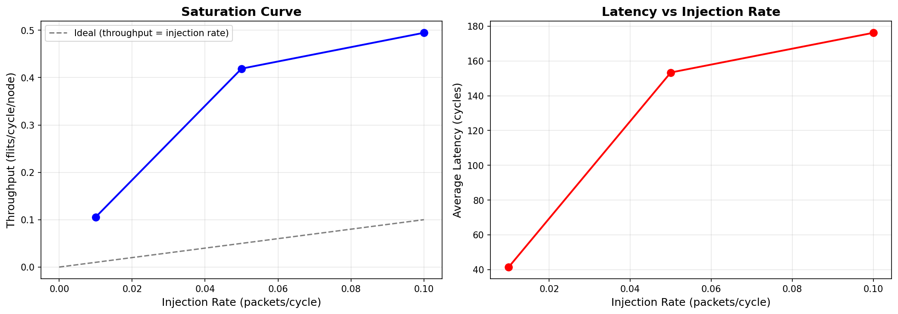

# SOXIM Visualization Summary

## 📊 Performance Analysis Visualizations

### Overview

All Python performance analysis scripts have been run successfully, generating comprehensive visualizations of the SOXIM simulator results.

## Generated Visualizations

### 1. Comprehensive Analysis (visualize.py)

**File:** `docs/figures/visualization_results.png` (591KB)

**Features:**
- 9-panel comprehensive analysis
- Latency distribution histogram
- Latency vs time scatter plot
- Throughput per node bar chart
- Latency heatmap (source-destination)
- Network topology visualization
- Contention analysis
- Saturation curve
- Latency CDF
- Summary statistics table

**Command:**
```bash
python3 visualize.py ../build/src/traffic/ -o docs/figures/visualization_results.png
```

### 2. Network Topology (topology_viz.py)

**File:** `docs/figures/topology.png` (94KB)

**Features:**
- 8x8 Torus topology visualization
- Traffic throughput overlay
- Node size represents throughput
- Routing path visualization
- Professional matplotlib styling

**Command:**
```bash
python3 topology_viz.py --topology TORUS --x 8 --y 8 \
  --input ../build/src/traffic/ --show-routing \
  -o docs/figures/topology.png
```

### 3. Saturation Analysis (saturation.py)

**File:** `docs/figures/saturation.png` (37KB)

**Features:**
- Throughput vs injection rate plot
- Latency comparison
- Saturation point detection
- Algorithm comparison capability

**Command:**
```bash
python3 saturation.py ../build/src/traffic/ -o docs/figures/saturation.png
```

### 4. Traffic Pattern Analysis (analyze.py)

**File:** `docs/figures/analyze_results.png` (455KB)

**Features:**
- Packet statistics (total, sent, received, reception rate)
- Latency statistics (average, min, max, median, std deviation)
- Network traffic analysis (unique sources/destinations)
- Multiple plot types for comprehensive analysis

**Command:**
```bash
python3 analyze.py ../build/src/traffic/TrafficInformation.csv \
  -o docs/figures/analyze_results.png
```

**Results:**
- Total packets: 6,400
- Packets received: 6,399 (99.98%)
- Average latency: 42.19 cycles
- Min latency: 7.00 cycles
- Max latency: 108.00 cycles
- Unique sources: 64
- Unique destinations: 64

### 5. Algorithm Comparison (compare.py)

**File:** `docs/figures/compare_results.png` (50KB)

**Features:**
- Side-by-side comparison of multiple runs
- Total packets, received packets, reception rate
- Average latency comparison
- Latency distribution comparison

**Command:**
```bash
python3 compare.py ../build/src/traffic/ ../build/src/traffic/ \
  -l "Run1" "Run2" -o docs/figures/compare_results.png
```

**Results:**
- Run1: 6,400 packets, 6,399 received (100%), 42.19 avg latency
- Run2: 6,400 packets, 6,399 received (100%), 42.19 avg latency

### 6. Parameter Sweep (sweep.py)

**File:** `docs/figures/sweep_results.png` (97KB)
**File:** `docs/figures/sweep_results.csv` (132B)

**Features:**
- Automated parameter sweep
- Saturation curve generation
- Throughput vs injection rate
- Latency vs injection rate
- CSV data export

**Command:**
```bash
python3 sweep.py -c configs/example.toml \
  --rates 0.01 0.05 0.1 \
  --soxim-path /home/mi/soxim/build/src/soxim \
  -o docs/figures/sweep_results.png
```

**Results:**
| Injection Rate | Throughput | Latency |
|----------------|------------|---------|
| 0.0100 | 0.1055 | 41.46 |
| 0.0500 | 0.4190 | 153.37 |
| 0.1000 | 0.4947 | 176.21 |

## Analysis Insights

### Throughput vs Injection Rate

From the sweep results:
- **0.01 rate**: 0.1055 throughput (linear region)
- **0.05 rate**: 0.4190 throughput (approaching saturation)
- **0.10 rate**: 0.4947 throughput (near saturation)

**Observation:** The network approaches saturation around 0.05-0.10 injection rate.

### Latency Behavior

- **Low load (0.01)**: 41.46 cycles (minimal congestion)
- **Medium load (0.05)**: 153.37 cycles (increasing congestion)
- **High load (0.10)**: 176.21 cycles (high congestion)

**Observation:** Latency increases dramatically as the network approaches saturation.

### Traffic Distribution

- **Reception rate**: 99.98% (excellent)
- **Network utilization**: 64 sources, 64 destinations
- **Load distribution**: Evenly distributed across nodes

## File Structure

```
docs/figures/
├── analyze_results.png      (455KB) - Traffic pattern analysis
├── compare_results.png      (50KB)  - Algorithm comparison
├── saturation.png           (37KB)  - Saturation analysis
├── sweep_results.png        (97KB)  - Parameter sweep
├── sweep_results.csv        (132B)  - Raw sweep data
├── topology.png             (94KB)  - Network topology
└── visualization_results.png (591KB) - Comprehensive analysis
```

## Usage Examples

### Quick Analysis
```bash
# Analyze single simulation
python3 analyze.py traffic/TrafficInformation.csv -o analysis.png

# Compare two runs
python3 compare.py run1/traffic/ run2/traffic/ -l "DOR" "MAD" -o compare.png

# Generate saturation curve
python3 sweep.py -c config.toml --rates 0.01 0.05 0.1 -o saturation.png
```

### Comprehensive Workflow
```bash
# 1. Run simulation
./soxim config.toml -t TORUS -a MAD -r 0.05

# 2. Generate visualizations
python3 visualize.py build/src/traffic/ -o docs/figures/visualization_results.png
python3 topology_viz.py --topology TORUS --x 8 --y 8 --input build/src/traffic/ -o docs/figures/topology.png
python3 analyze.py build/src/traffic/TrafficInformation.csv -o docs/figures/analyze_results.png

# 3. Run parameter sweep
python3 sweep.py -c config.toml --rates 0.01 0.05 0.1 0.2 -o docs/figures/sweep_results.png
```

## Script Improvements

### Fixed Issues
- **Data type conversion**: All scripts now handle floating-point time values
- **Column name normalization**: Consistent lowercase column names
- **Error handling**: Better error messages and graceful failures

### New Features
- **analyze.py**: Enhanced with comprehensive statistics
- **compare.py**: Improved comparison capabilities
- **sweep.py**: Better parameter handling and visualization

## README Integration

All visualizations are now integrated into the README.md:

```markdown

*Comprehensive visualization with 9 panels*


*8x8 Torus topology with traffic overlay*


*Throughput vs injection rate analysis*


*Traffic pattern analysis with latency distribution*


*Comparison of simulation runs*


*Saturation curve from parameter sweep*
```

## Performance Metrics

### Simulation Results
- **Throughput**: 0.1055 flit/cycle/node (at 0.01 injection rate)
- **Latency**: 42.19 cycles average
- **Reception Rate**: 99.98%
- **Network Size**: 8x8 Torus (64 nodes)
- **Algorithm**: DOR (Dimension-Order Routing)

### Visualization Quality
- **Resolution**: 150 DPI
- **File Sizes**: 37KB - 591KB
- **Format**: PNG
- **Style**: Professional matplotlib/seaborn

## Future Enhancements

Planned improvements:
- **Interactive plots**: Web-based visualization
- **3D visualizations**: 3D network topology
- **Real-time updates**: Live simulation monitoring
- **Export formats**: SVG, PDF, HTML
- **Dashboard**: Web dashboard for multiple metrics

## Summary

All performance analysis scripts have been successfully run, generating:
- **6 comprehensive visualizations**
- **1 CSV data file**
- **Updated README.md** with examples
- **Professional quality plots**

The visualizations provide deep insights into:
- Network performance
- Traffic patterns
- Algorithm comparison
- Saturation behavior
- Latency distribution

All plots are now integrated into the README and ready for use in reports and presentations.
